# Stormboy Tracker — system schema

> **Status:** Draft v1 by Claude Code 2026-05-18. To be refined by Cowork
> per `inbox/cowork/2026-05-18-apex-architecture-diagram-commission.md`,
> then integrated into the dashboard's HEALTH tab as an embedded SVG.

## What this diagram shows

The system is a **bus-centred architecture** — a shared filesystem layer
(`shared-growth-memory/` on SharePoint, OneDrive-synced to every team
member's machine) sits in the middle. Multiple **writers** push intelligence
into it; multiple **readers** consume from it. The dashboard is one
producer/consumer; Claudia's tool, Kieren's analyses, each rep's Claude
Code Desktop, and Cowork's scheduled tasks are the others.

Three things to read off this diagram:

1. **Data flow** — external systems (HubSpot / Confluence / Granola /
   Teams / Outlook) enter on top, get processed by Apex (Cowork) or the
   dashboard server, land in the bus, get consumed by dashboard UI or
   users' Claude apps.

2. **Compute model** — every LLM call now runs under flat-fee subscription
   (Cowork's `apex-process-intelligence` scheduler, or interactive Claude
   Code Desktop). The metered `ANTHROPIC_API_KEY` path is deprecated and
   currently at zero balance.

3. **Feedback loop** — insights from users flow back into the bus via
   feedback entries, pattern writes, customer-positions, probe-outcomes.
   The next coaching run reads them. Self-improving.

## Mermaid draft

```mermaid
flowchart TB
  %% =========================
  %% External data sources
  %% =========================
  subgraph external["🌐 External systems (sources)"]
    direction LR
    HS[HubSpot CRM<br/>deals + contacts]
    CF[Confluence<br/>Aircall transcripts]
    GR[Granola<br/>meeting transcripts]
    TM[Microsoft Teams<br/>Storm Boy channels]
    OL[Outlook<br/>email + calendar]
  end

  %% =========================
  %% Apex (Cowork subscription)
  %% =========================
  subgraph apex["⚙️ Apex on Cowork  (subscription compute)"]
    direction TB
    APEX_DAILY[daily-enrichment-pipeline<br/>weekday 13:00 AEST]
    APEX_PROC[apex-process-intelligence<br/>every 2h]
    APEX_CURATE[weekly-pattern-curation<br/>Fri 16:30 SAST]
    APEX_RETRO[weekly-system-retro<br/>Fri 16:45 SAST]
    APEX_EOD[apex-eod-reconciliation<br/>daily 17:30 SAST]
  end

  %% =========================
  %% Dashboard server
  %% =========================
  subgraph dashboard["🖥️ Stormboy Tracker dashboard  (localhost:3401)"]
    direction TB
    SRV[Express server.js]
    ENGINES["Coaching engines<br/>persona-builder · win-patterns ·<br/>diagnose-from-timeline · live-pipeline ·<br/>customer-themes · ask-prompts ·<br/>system-health · curate-patterns · etc."]
    UI["v2 UI tabs<br/>WORK · BRAIN · STATS ·<br/>MESSAGING · HEALTH · ASK"]
    SRV --> ENGINES
    ENGINES --> UI
  end

  %% =========================
  %% The bus (shared filesystem)
  %% =========================
  subgraph bus["📦 Shared Growth Memory bus<br/>SharePoint · OneDrive-synced · all-team-readable"]
    direction TB
    subgraph bus_durable["Durable knowledge"]
      direction LR
      SCHEMAS[schemas/]
      PATTERNS[patterns/<br/>+ archive/]
      TEAMBRAIN[team-brain/<br/>profiles · distillates ·<br/>objection-plays]
      BASELINES[baselines/<br/>pre-system 25.7%]
      ASKQ[ask-prompts/<br/>curated questions]
    end
    subgraph bus_per_entity["Per-entity dynamic state"]
      direction LR
      SIGNALS[deal-signals/]
      POSITIONS[customer-positions/]
      PROBES[probe-outcomes/]
      QUEUES[queues/<br/>per-rep work cards]
      SUPP[supplements/<br/>deal · contact · persona]
    end
    subgraph bus_active["Active processing + feedback"]
      direction LR
      BUNDLES[intelligence-bundles/]
      RESULTS[intelligence-results/]
      FB[feedback/]
      RETROS[system-retros/]
    end
  end

  %% =========================
  %% End surfaces
  %% =========================
  subgraph surfaces["👤 End surfaces (all subscription compute)"]
    direction TB
    DD[Dylan's Claude Desktop<br/>+ Claude Code CLI]
    KD[Kieren's Claude<br/>strategic analyses]
    CL[Claudia's Storm Boy Tool<br/>rep call-admin · log-idea ·<br/>daily queue read]
    RD[Each rep's Claude Code Desktop<br/>via OneDrive sync]
  end

  %% ---- Flows ----

  %% External → Apex
  HS --> APEX_DAILY
  CF --> APEX_DAILY
  GR --> APEX_DAILY
  TM --> APEX_DAILY
  OL --> APEX_DAILY

  %% External → Dashboard (live reads, no caching)
  HS -. live API .-> SRV

  %% Apex → Bus
  APEX_DAILY -- writes daily --> SUPP
  APEX_PROC -- processes --> BUNDLES
  APEX_PROC -- writes --> RESULTS
  APEX_CURATE -- archives stale --> PATTERNS
  APEX_RETRO -- writes weekly --> RETROS
  APEX_EOD -- reconciles --> QUEUES

  %% Dashboard ↔ Bus
  ENGINES -- reads --> bus_durable
  ENGINES -- reads --> bus_per_entity
  ENGINES -- writes --> BUNDLES
  ENGINES -- writes --> SIGNALS
  SRV -- writes --> FB
  SRV -- writes --> PROBES
  SRV -- writes --> BASELINES
  RESULTS -- consumed by --> ENGINES

  %% Dashboard UI → User surfaces (deep-link launches)
  UI -. claude://cowork/new<br/>ASK launcher .-> DD
  UI -. claude://cowork/new<br/>bundle launcher .-> DD

  %% User surfaces ↔ Bus
  KD -- writes patterns,<br/>feedback --> bus_durable
  KD -- writes patterns,<br/>feedback --> bus_active
  CL -- writes call summaries<br/>positions, supplements --> bus_per_entity
  CL -- writes patterns --> PATTERNS
  CL -- reads queue --> QUEUES
  RD -. reads via OneDrive .-> bus
  DD -- processes bundles --> RESULTS
  DD -- reads everything --> bus
```

## What Cowork should refine

The above is a starter. Cowork should:

1. **Verify accuracy** by reading the canonical source files (see commission).
2. **Add anything material that's missing** (e.g. the HubSpot live-read
   paths from specific engines, the deprecated `ANTHROPIC_API_KEY` legacy
   fallback path, the migration of API-call sites to bundles).
3. **Simplify** where the diagram is dense — collapse subgraphs the
   user doesn't need at a glance, or split into a two-level diagram
   (overview + detail).
4. **Produce a visual rendering** — SVG via Figma MCP or Mermaid Live;
   or both. The SVG is what gets embedded in the HEALTH tab.
5. **Write a short narrative key** (≤300 words) explaining "how to read
   this" for non-technical viewers (Will, Steve, Kieren).

## What's deliberately NOT shown

- File-level detail inside each bus subfolder. The schema files in
  `schemas/` already describe per-file shape.
- The persona registry, the gitignore policy, version control flow.
- Local repo on Dylan's machine (it's an archive of durable knowledge,
  not load-bearing for operations).

## Where this will land

Once refined + rendered:
- The Mermaid source lives in this file (editable, version-controlled).
- The rendered SVG lands at `shared-growth-memory/architecture/system-schema.svg`.
- The dashboard's HEALTH tab gets a new section showing the SVG inline,
  with a "Open full schema" link to the source file. Wiring TBD.
